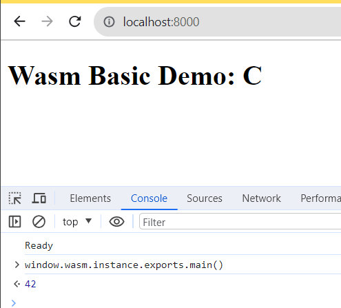

# Getting started


**Step 1** - CD into this folder

```powershell
cd 01_JS_WebAssembly_Example
```

**Step 2** - install dependencies

```js
npm install
```

**Step 3** - run

```js
node server.js
```

## Basic example - return a value from wasm

```c
int input();
int label(int val);

int main() { 
  return 42;
}

void updateNumber() {
  label(input() * 2);
}
```


```js
window.wasm.instance.exports.main()
```



## Basic example - pass into wasm a value and have it update the DOM

Open up browser developer tools and in the Console, enter `wasm.instance.exports.updateNumber()`


