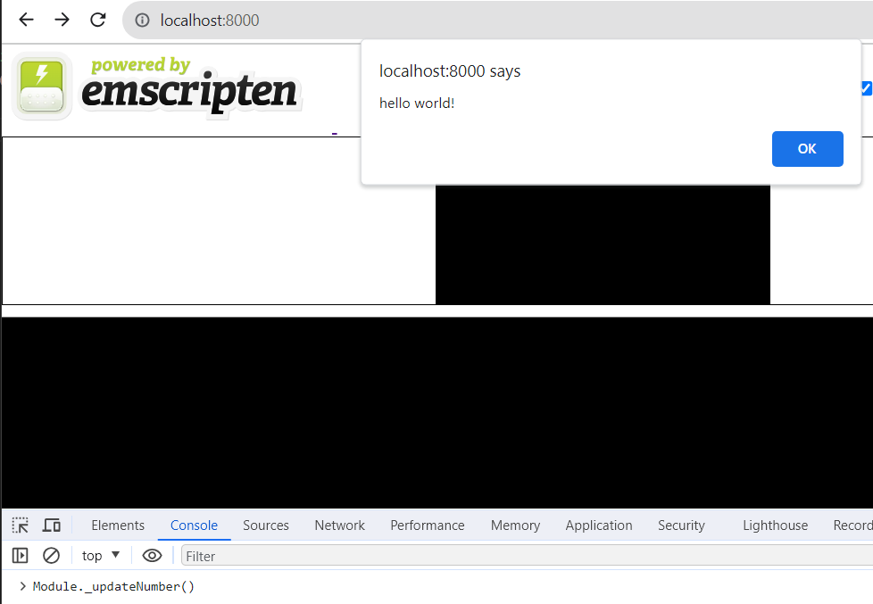
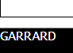

# Getting started

To build both wasm and JS wrapper, use emscripten. 

```powershell
docker pull emscripten/emsdk
```

Ensure Docker for Desktop is running, then build the wasm binary format file:

**Step 1** - CD into this folder

```powershell
cd 02_Emscripten_Example
```

**Step 2** - build wasm

```powershell
docker run --rm -v .:/src emscripten/emsdk emcc 02_Emscripten_Example/lib/basic.c -o 02_Emscripten_Example/public/index.html -s EXPORTED_FUNCTIONS="['_main','_updateNumber']"
```

**Step 3** - run

```powershell
node server.js
```

Open up browser developer tools and in the Console, enter `Module._updateNumber()`

You'll see the alert popup first:



Then you'll see the textarea update:

