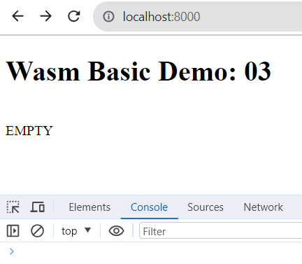
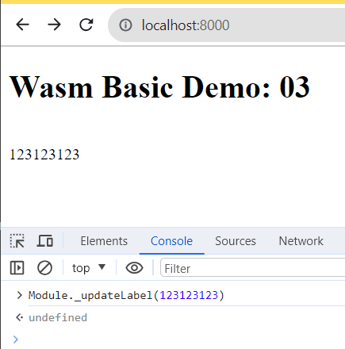

# Getting started

To build both wasm and JS wrapper, use emscripten. 

```powershell
docker pull emscripten/emsdk
```

Ensure Docker for Desktop is running, then build the wasm binary format file:

**Step 1** - CD into this folder

```powershell
cd 03_Emscripten_Example_Simpler
```

**Step 2** - build wasm

```powershell
docker run --rm -v .:/src emscripten/emsdk emcc 03_Emscripten_Example_Simpler/lib/basic.c -o 03_Emscripten_Example_Simpler/public/index.js -s EXPORTED_FUNCTIONS="['_main','_updateLabel']"
```

**Step 3** - run

```powershell
node server.js
```



Open up browser developer tools and in the Console, enter `Module._updateLabel(123123123)`

Then you'll see the label update:

