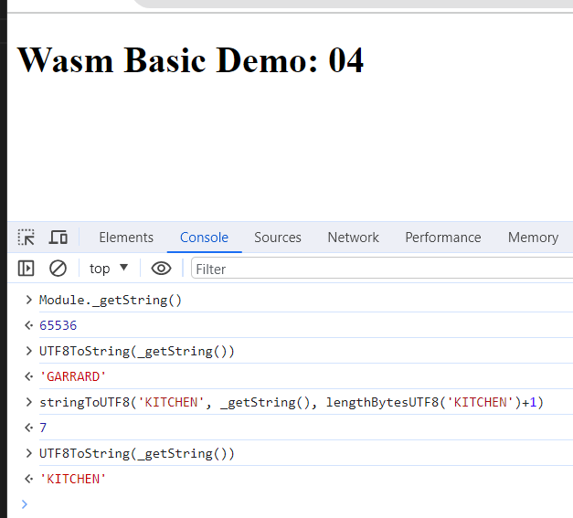

# Getting started

This example returns a string and shows you how to update it's value in memory. 

To build both wasm and JS wrapper, use emscripten. 

```powershell
docker pull emscripten/emsdk
```

Ensure Docker for Desktop is running, then build the wasm binary format file:

**Step 1** - CD into this folder

```powershell
cd 04_Emscripten_Example_String
```

**Step 2** - build wasm

ℹ️ _We need 2 functions from preamble - stringToUTF8 and lengthBytesUTF8 - so include these by using the DEFAULT_LIBRARY_FUNCS_TO_INCLUDE option_

```powershell
docker run --rm -v .:/src emscripten/emsdk emcc 04_Emscripten_Example_String/lib/basic.c -o 04_Emscripten_Example_String/public/index.js -s EXPORTED_FUNCTIONS="['_getString']" -s DEFAULT_LIBRARY_FUNCS_TO_INCLUDE='$stringToUTF8,$lengthBytesUTF8'
```

**Step 3** - run

```powershell
node server.js
```

Open up browser developer tools and in the Console, enter the followng snippets.  There's a screenshot at the end to see what to expect.

This will return the pointer to the memory allocation:

```js
Module._getString()
```

To confirm the pointer to a UTF-8 string:

```js
UTF8ToString(_getString())
```

To update it's value in memory (_please note the '+1' to accommodate for special characters_):

```js
stringToUTF8('KITCHEN', _getString(), lengthBytesUTF8('KITCHEN')+1)
```

To confirm it has updated the value:
```js
UTF8ToString(_getString())
```

Example:

